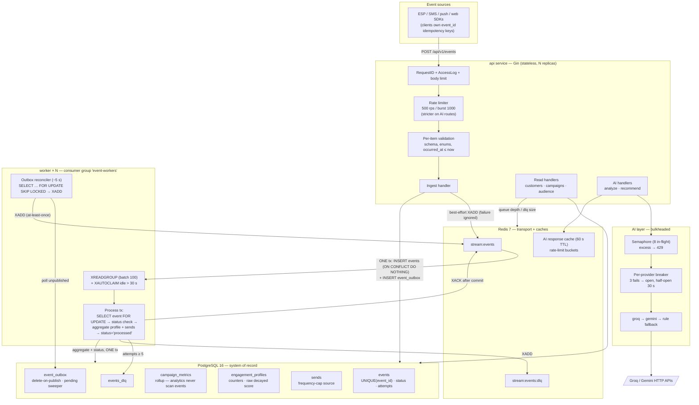

# System Design — MarTech Intelligence & Campaign Decision Engine

Status: design authority for the reviewers. Interface details are pinned by
`docs/CONTRACTS.md`; where the two disagree, CONTRACTS.md wins (it is the
file every workstream codes against).

---

## 1. Problem statement and design targets

We ingest marketing engagement events (sends, opens, clicks, conversions,
bounces, …) from ESP/SMS/push/web sources, build per-customer engagement
intelligence, and expose it to three consumers: humans reading profiles and
campaign analytics, an audience recommender, and an LLM layer that narrates
campaign performance.

**Functional requirements**

- Idempotent, batched, asynchronous event ingestion (≤500 events/call, `202`).
- Per-customer engagement profile + live decayed score; event timeline.
- Campaign metrics (counts, rates, per-channel breakdown, anomaly flags).
- Audience recommendation: top-K ranking under constraints (score floor,
  recency, channel affinity, frequency caps, exclusions).
- AI campaign analysis/recommendations that never fail the request.
- Operability: health, dead-letter queue inspection and replay.

**Non-functional targets** (the numbers the design is built around)

| Quantity | Target | Note |
|---|---|---|
| Ingest volume | 10M events/day ≈ **116/s avg** | sized for **10× → ~1.2k/s** peaks |
| Ingest API latency | p99 < 100 ms | one tx: `INSERT events` + `INSERT event_outbox` |
| End-to-end freshness | p99 < 10 s event → profile | reconciler bound (~5 s) + worker latency |
| Duplicate correctness | 100% | Postgres UNIQUE is the only authority |
| Event loss | 0 after `202` | transactional outbox |
| Worker crash safety | no double-apply | status check inside `FOR UPDATE` tx |
| AI availability | 100% of HTTP 200s | rule-based fallback, `fallback_used` flag |
| Audience recommend | O(N log K), indexed prefilter | K ≤ 100k, N = prefiltered rows |

**Deliberate simplifications** (demo scope, stated honestly): single Postgres
primary, Redis Streams (not Kafka), in-process metrics (not Prometheus), no
auth on endpoints (§10 covers what production adds). Every simplification has
a named upgrade path in §11.

---

## 2. Architecture



**Component choices, briefly:**

- **Postgres as system of record and dedup authority.** Events land in a
  relational store because every downstream read (profiles, analytics,
  frequency caps, timeline) is relational. One `UNIQUE(event_id)` constraint
  gives exactly-once *effect* without a dedup service.
- **Redis Streams as transport**, not source of truth. Streams give consumer
  groups, per-message acks, pending-entry inspection and `XAUTOCLAIM` — the
  minimum semantics for at-least-once delivery with crash recovery — at a
  fraction of Kafka's operational cost. The `events` row is durable; the
  stream message is a pointer (`event_db_id`), so Redis data loss degrades
  latency, never correctness (the outbox reconciler republishes).
- **Worker separate from api.** Ingest and processing scale on different
  axes and fail independently. For free-tier demos a single binary can run
  both (`RUN_EMBEDDED_WORKER=true`, §8 of CONTRACTS.md, DEPLOYMENT.md §3).

---

## 3. Data flows

### 3.1 Ingest path (write)

```
client → POST /events (≤500 items)
  → body-size limit + JSON parse            (malformed → 400, whole request)
  → per-item validation                     (bad item → rejected[i], keep going)
  → resolve external_ids → BIGINT ids       (customer_id, campaign_id)
  → ONE Postgres tx per batch:
      INSERT events … ON CONFLICT (event_id) DO NOTHING RETURNING id
        – row returned  → new event, status='pending'
        – nothing       → duplicate: count it, do NOT write outbox
      INSERT event_outbox(event_db_id)      (same tx — never stranded)
  → COMMIT → 202 {accepted, duplicates, rejected[]}
  → post-commit (async, best-effort):
      XADD stream:events {event_db_id}      – low-latency fast path
      Redis SETNX dedup hint                – read optimization ONLY
```

The response is sent **after** the DB commit, so a `202` means the event is
durable even if Redis, the XADD, or the process dies immediately after.

### 3.2 Processing path (worker)

```
reconciler goroutine (every ~5 s, every worker, SKIP LOCKED so no contention):
  SELECT id, event_db_id FROM event_outbox
   WHERE published_at IS NULL ORDER BY id LIMIT n FOR UPDATE SKIP LOCKED
  → XADD stream:events → DELETE the outbox row
  (covers: crashed-before-XADD, Redis flushed, best-effort publish lost;
   DELETE keeps the outbox bounded — a published row's only job was to
   carry the id to the stream)

pending sweeper (same tick): events stuck at status='pending' >30 s
  are re-enqueued — closes the "published but stream entry lost/evicted"
  hole (idx_events_status makes the lookup cheap)

consumer loop per worker:
  XREADGROUP group=event-workers count=100 block
  + periodic XAUTOCLAIM for messages idle > WORKER_CLAIM_IDLE_MS (30 s)
  batch fanned out over WORKER_CONCURRENCY (default 8) goroutines —
  serial loop capped ~100-150 ev/s; FOR UPDATE makes contention safe
  per message, ONE tx:
    SELECT * FROM events WHERE id=$1 FOR UPDATE
      status ∈ {processed, duplicate} → COMMIT → XACK → done   (redelivery)
      status = 'failed'               → COMMIT → XACK → done
    processor.ProcessTx(tx, evt):     mutate engagement_profiles
                                    (counters, channel_counts, GREATEST
                                    last_event_at, decayed score per §6)
                                    + INSERT sends when type='sent'
                                    + campaign_metrics rollup upsert
                                    (analytics never scan events)
    UPDATE events SET status='processed', processed_at=now()
  COMMIT → XACK
  on error: ROLLBACK; separate tx attempts++, last_error;
            attempts ≥ 5 → status='failed' + events_dlq row
            + XADD stream:events:dlq + XACK
```

### 3.3 Read path

- `GET /customers/{id}` → join `customers` + `engagement_profiles`; normalize
  the **raw** stored score at read time (`score/(score+k)`); never store the
  normalized value.
- `GET /customers/{id}/timeline` → `idx_events_customer_time
  (customer_id, occurred_at DESC)`, keyset cursor `(occurred_at, id)` —
  stable under late-arriving events, unlike OFFSET.
- `GET /campaigns/{id}/analytics` → aggregate `events` grouped by
  `campaign_id, type` via `idx_events_campaign_type`; rates and anomaly
  flags computed in Go.
- `POST /audience/recommend` → SQL prefilter on indexed columns
  (`idx_profiles_score`, `idx_profiles_last_event`, `preferred_channel`,
  `is_active`) → stream rows through a **min-heap of size K** → per-survivor
  frequency-cap check against `sends` (`idx_sends_freq`, one batched
  `GROUP BY` count over the window, not N queries) → reason strings →
  `{candidates, meta{candidates_considered, filtered_out, took_ms}}`.

### 3.4 AI path

`POST /campaigns/{id}/analyze|recommend` → facts computed in Go from
`AnalyticsService.Metrics` (the LLM never queries the DB) → cache lookup
(`campaign_id + metrics_version + prompt_version`, 5 min) → semaphore →
breaker → provider chain `groq → gemini → rule fallback` → output
validation (schema + confidence range + number-containment) → response
`{facts, analysis|recommendations, provider, fallback_used}`. Full detail:
`docs/AI_DESIGN.md`.

---

## 4. Schema decisions

- **`TEXT` + `CHECK` constraints instead of PG enums** — adding a channel or
  event type is an `ALTER … DROP/ADD CHECK`, not an enum migration that locks
  the table. Cheap insurance for a schema that will evolve.
- **`payload JSONB` on events, `attributes JSONB` on customers** — the part
  of the data with no stable shape. Everything we *query* on is a real
  column; JSONB is for passthrough/debugging.
- **Internal `BIGINT` ids, external `external_id` strings** — joins and
  indexes stay on 8-byte keys; clients never see internal ids (contract §6).
- **Index set** (see `migrations/000001_init.up.sql`): every hot read has a
  dedicated index — timeline `(customer_id, occurred_at DESC)`, campaign
  aggregates `(campaign_id, type)`, pending-scan partial index
  `(status) WHERE status='pending'`, outbox partial index on unpublished
  rows, score/recency indexes on `engagement_profiles`, frequency window on
  `sends(customer_id, sent_at DESC)`. No index was added without a named
  query that uses it.
- **`sends` as its own table** — frequency capping and audience exclusion
  need send history independent of whether a `sent` event arrived; the
  worker inserts into `sends` inside the same atomic tx as profile updates.

---

## 5. Reliability — why the design looks like this

### 5.1 The transactional outbox exists because commit and publish can't be atomic

The naive ingest is `INSERT events; COMMIT; XADD`. The crash window between
commit and XADD loses the event *silently* — the API returned 202, the row
exists, nothing ever processes it. The alternative order (`XADD` then commit)
is worse: a stream message pointing at a row that rolled back.

The outbox makes the DB the only place that must be correct: the outbox row
is written **in the same transaction** as the event, so "committed but
unpublished" is a *queryable, repairable* state, not a lost write. The
reconciler (~5 s poll, `FOR UPDATE SKIP LOCKED` so multiple workers don't
fight) closes the gap. Best-effort XADD post-commit keeps the common case at
stream latency; the reconciler is the floor, not the path.

Double-publish is inherent to the design (API publishes *and* reconciler may
republish after a crash between XADD and the outbox DELETE). That is
safe because consumers are idempotent (§5.3). **At-least-once delivery +
idempotent consumer is strictly easier to get right than exactly-once
delivery.** The stream itself is `XADD MAXLEN ~1M` — a bounded pointer
buffer; Postgres is the durability layer, and the pending sweeper recovers
entries evicted before consumption.

### 5.2 Aggregation and status flip are atomic because partial progress is corrupting

If profile mutation committed but `status='processed'` didn't (crash
between two transactions), redelivery would re-apply the event — counters
double-counted, score inflated, and there'd be no marker to detect it. The
reverse order has the same problem. Putting **both** in one transaction
means every event is either fully applied or not at all; there is no third
state to repair.

### 5.3 Redelivery is safe because the status check is inside the lock

A message can be delivered more than once (double-publish, `XAUTOCLAIM`
reclaim, retry after a crash post-commit/pre-XACK). The consumer handles
this with `SELECT … FROM events WHERE id=$1 FOR UPDATE` and a status check
**inside** the lock. Two workers racing the same `event_db_id` serialize on
the row lock: the second sees `status='processed'` and acks without work.
Checking-then-locking would leave a TOCTOU window; the lock-then-check
order is the whole trick, and it costs one row lock per message.

The same `FOR UPDATE` on the `engagement_profiles` row serializes
concurrent events for the same customer — counters and score are read-
modify-write, so serialization is mandatory; doing it in the DB (not in app
locks) keeps it correct across N worker processes.

### 5.4 Failure funnel

```
XADD fails post-commit        → reconciler republishes within ~5 s
process tx fails              → rollback, attempts++ (bounded, 5)
attempts exhausted            → status='failed' + events_dlq + DLQ stream + XACK
DLQ replay endpoint           → re-enqueue; original payload preserved
```

Retries are capped because a poison message must not stall the group
forever; the DLQ preserves payload + error + attempt count so replay and
forensics are an endpoint call, not a `redis-cli` session.

---

## 6. Scoring under out-of-order delivery (contract §7)

Events arrive out of order (`occurred_at` is client time). The score is a
decayed sum `score(now) = Σ wᵢ·exp(−λ·(now−tᵢ))` with half-life 14 d
(`λ = ln2/14 d ≈ 0.0495/day`). We persist the **raw** score plus an anchor
`score_updated_at`, and apply decay lazily at the next write:

- `t ≥ anchor` (in order): `raw′ = raw·exp(−λ·(t−anchor)) + w`, `anchor = t`
- `t < anchor` (out of order): `raw′ = raw + w·exp(−λ·(anchor−t))`, anchor
  unchanged — the late event is decayed to what it was worth *at the
  anchor*, which is exactly what the closed-form sum says it contributes.

Both branches are associative updates to the same sum, so the final `raw` is
identical for any delivery order — that is what makes OOO safe without
re-sorting history. Normalization (`score/(score+k)` or tanh) happens **only
at read/display time**; decaying a normalized value would be wrong because
the map is nonlinear. Negative-signal weights can drive `raw` below 0 —
clamped at 0. `last_event_at` uses `GREATEST(occurred_at)`; timeline order
is a read-time `ORDER BY`, so storage never depends on arrival order.

---

## 7. Failure & concurrency scenarios

Each: **Problem → Approach → Trade-offs.**

**1. Duplicate ingestion (client retries, double-POST).**
Problem: clients retry on timeout; the same `event_id` may arrive many
times, possibly in one batch.
Approach: `events.event_id UNIQUE` is the only dedup authority —
`INSERT … ON CONFLICT DO NOTHING RETURNING id`; no row ⇒ count as
`duplicates` in the 202 response. A Redis `SETNX` may be written *after*
commit as a fast hint for read paths, but is never consulted to classify
duplicates — a stale Redis key (eviction, flush, SETNX-without-commit
ordering bug) must not suppress a legitimate retry.
Trade-offs: one index probe per event on every insert — the cost of
correctness; Redis hint adds write amplification for a read optimization
that must stay strictly advisory.

**2. Out-of-order events.**
Problem: mobile/offline sources deliver `occurred_at` out of order by hours.
Approach: commutative aggregation — counters are `+1`; `last_event_*` uses
`GREATEST(occurred_at)`; decayed score uses the anchored formula in §6
which is order-insensitive by construction; timeline sorts at read time.
Trade-offs: a very late event can't *remove* a "last_event_type" that a
later event already claimed — acceptable, profiles are approximate
summaries; alternatively a periodic profile rebuild from `events` — more
correct, far more expensive, deferred to §11.

**3. Worker crash / failure mid-processing.**
Problem: a worker dies holding un-acked messages.
Approach: Redis consumer group `event-workers`; peers `XAUTOCLAIM` entries
idle > `WORKER_CLAIM_IDLE_MS` (30 s); the atomic process tx (§5.2–5.3)
makes re-execution safe; XACK only after commit.
Trade-offs: a crashed worker's messages wait up to 30 s before reclaim —
chosen over aggressive reclaim, which would double-process *slow* messages
(harmless but wasteful) and increase lock contention on hot profiles.

**4. LLM provider down / slow.**
Problem: Groq/Gemini outage or latency spike must not take down the API or
the endpoint.
Approach: dedicated `http.Client` with 15 s timeout; per-provider circuit
breaker (3 consecutive failures → open, half-open probe after 30 s);
provider chain `groq → gemini → deterministic rule fallback` — the
fallback produces structurally identical output from computed facts, so the
request never fails (`fallback_used: true` tells the caller).
Trade-offs: fallback output is generic by design; breaker state is
in-process per replica (a fleet-wide breaker needs shared state — Redis —
deferred); 15 s × chain depth bounds worst-case latency at ~30 s before
fallback, mitigated by the 5-min response cache.

**5. Invalid / malformed AI output.**
Problem: LLMs return truncated JSON, wrong schema, or invented numbers.
Approach: strict output validation — JSON schema check, `confidence ∈
[0,1]`, and **number containment**: every numeric claim in the analysis
must match a value in the computed `facts` (or a directly derived quantity)
— the model literally cannot cite a statistic we didn't compute. On
failure: one retry with a corrective prompt, then next provider, then rule
fallback.
Trade-offs: number containment occasionally rejects a correctly-rounded
restatement (4.2% vs 4.18%) — validation accepts rounding within
tolerance; the check is the price of trusting the output at all.

**6. Concurrent events for the same customer.**
Problem: two workers process `opened` + `clicked` for one customer
simultaneously — read-modify-write on counters/score races.
Approach: `SELECT … FOR UPDATE` on the `engagement_profiles` row inside the
process tx serializes per-customer mutation across all workers; different
customers still process fully in parallel.
Trade-offs: a single hot customer serializes (by necessity); row locks are
held only for the tx duration (~ms); deadlock risk is low because lock
order is fixed (event row → profile row → sends insert).

**7. Frequency limits on sends.**
Problem: campaigns must not over-mail a customer (cap `frequency_cap` per
`frequency_window_hours`, default 3 per 168 h).
Approach: `sends` rows written in the process tx are the authoritative
history; the recommender counts sends in the window with one batched
`GROUP BY customer_id` over the top-K survivors via
`idx_sends_freq(customer_id, sent_at DESC)` — not N point queries.
Trade-offs: counting *after* the heap can leave < K survivors (reported
honestly in `meta.filtered_out`); counting inside the prefilter would be
cheaper per row but would mis-handle overlapping windows — correctness of
the cap beats filling the audience.

**8. Huge audiences / large customer base.**
Problem: ranking 50k+ profiles naively is O(N log N) in memory; at 10M
customers it's a table scan.
Approach: indexed SQL prefilter (score floor, recency, channel, activity —
`idx_profiles_score`, `idx_profiles_last_event`, covering
`idx_profiles_audience`) shrinks N before ranking; the stream is then
**bounded to `LIMIT min(10·size, 200_000)`** by raw stored score; top-K via
a **min-heap of size K** — O(pool log K) time, O(K) memory, K ≤
100k; stream rows from pgx, never materialize the full set.
Trade-offs: the candidate pool makes top-K *approximate* — Go-side
objective re-weighting can reorder within the pool, so a true top-K member
below the 10·size raw-score cut is missed; `meta.candidates_truncated`
reports when the pool hit the limit. Exact ranking would require scanning
every matching row — at multi-million scale that is the case for an
analytical store (§11). `min_score` arrives normalized [0,1) and is
inverted to raw units (`raw = 10·s/(1−s)`) before the indexed comparison;
stored scores are anchor-time values so the floor is slightly
over-inclusive (decay only shrinks raw). Reason strings are computed only
for survivors — O(K) not O(N).

**9. Invalid payloads at ingest.**
Problem: one bad item must not fail a 500-event batch; bad data must not
reach the stream.
Approach: per-item validation (required fields, channel/type enums,
`occurred_at` not in the future, resolvable external ids); failures go to
`rejected[{index, reason}]`, valid items commit; whole-request JSON
malformed → 400. Contract: `202` with item-level detail.
Trade-offs: partial-accept semantics mean clients must inspect `rejected[]`
— documented in openapi.yaml; rejecting the whole batch would be simpler
but punishes good data for bad data.

**10. Traffic spikes.**
Problem: a send-time burst (a campaign launch) concentrates load; upstream
retries amplify it.
Approach: layered backpressure — token bucket at the edge
(`RATE_LIMIT_RPS=500`, burst 1000, per-key in prod); batch insert caps
request work (≤500 items/tx); the stream + outbox decouple ingest rate
from processing rate — workers drain at their own pace, queue depth is the
buffer and the observable; workers scale horizontally (consumer group,
`SKIP LOCKED` reconciler) without code change.
Trade-offs: under sustained overload, freshness degrades linearly while
correctness is preserved — the right trade for an analytics-adjacent
system; 429s shift retry responsibility to clients, which own idempotency
keys so retries are safe.

---

## 8. Scale plan (10M events/day and beyond)

**Baseline math.** 10M events/day ≈ 116/s average; sized for 10× ≈
1.2k/s peak. Ingest is one tx per ≤500-event batch (2 `ANY` lookups +
one multi-row insert + one outbox insert ≈ 4 statements), so the pgx pool
(`DB_MAX_CONNS`, default 20) carries peak with wide headroom — measured
~50–60 ms per 500-event batch. Workers: batch 100 per `XREADGROUP` fanned
out over `WORKER_CONCURRENCY` (default 8) goroutines; one process-tx is a
few indexed writes (~5 ms), so a single worker process sustains ~800–1.2k
msg/s — 1–2 workers cover the 1.2k/s peak. Horizontal scaling is `docker
compose up --scale worker=N`, not a code change (consumer groups +
`SKIP LOCKED` reconcile already assume N). Hot-customer traffic is the
known serialization boundary: events for one customer serialize on its
profile row lock by design.

**Storage growth.** ~1 KB/event row incl. payload → ~10 GB/day, ~300
GB/month on `events`. Plan:

- **Monthly partitioning** of `events` by `occurred_at`
  (`PARTITION BY RANGE`) once volume justifies it: partition drops are
  instant retention, index builds stay per-partition, and `SELECT …
  FOR UPDATE` hot rows live in the current partition. (Declared
  partitioning is added behind a migration; the schema stays valid
  unpartitioned at demo scale.)
- **Retention**: hot data 90 days; older partitions exported to object
  storage (Parquet) and dropped — the `events` table is an operational
  store, not a warehouse.
- **Read replicas** for analytics-style reads (campaign aggregates,
  audience prefilter candidates) once primary read load matters; writes
  and all `FOR UPDATE` paths stay on the primary.
- **Analytical store** (ClickHouse/BigQuery) beyond ~100M rows of live
  analytical need: the event stream already produces a clean append feed —
  a consumer that dual-writes to the columnar store is additive, not a
  rewrite.
- **Backpressure end to end**: edge rate limit → bounded request work →
  durable outbox → stream buffer → worker pace; `queue_depth` and
  `oldest_pending_age` (§9) are the signals that tell you to add workers.

---

## 9. Observability

Current implementation: `core.RequestID()` middleware attaches/echoes
`X-Request-ID` on every request and log line; `core.AccessLog()` emits one
structured `slog` line (request_id, method, path, status, latency_ms);
`core.Metrics` holds in-process atomic counters (`Requests`, `Errors5xx`,
`EventsIngested`, `Duplicates`) surfaced on `/system/health` alongside
`postgres`, `redis`, `queue_depth`, `dlq_size`. `request_id` is logged on
every error path — that is the correlation key from a 500 back to the
request.

**Concrete signals the system must expose** (contract §11 — in-process
counters now; Prometheus/OTel exporters in prod, same names):

| Signal | Why |
|---|---|
| `queue_depth` (stream + outbox pending) | lag between ingest and processing |
| `oldest_pending_age` (oldest unpublished outbox row / oldest pending stream entry) | freshness SLO; reconciler health |
| retry rate, `attempts` distribution, `dlq_size` growth | poison messages, downstream breakage |
| row-lock wait on `events`/`engagement_profiles` (`pg_stat_activity`, `pg_locks`) | hot-customer contention |
| ingest `accepted/duplicates/rejected` rates | client behavior, dedup efficacy |
| LLM latency p50/p99, invalid-output rate, fallback rate, breaker state | AI bulkhead health |
| audience `candidates_considered`, `filtered_out`, `took_ms` | prefilter selectivity, heap cost |
| pgx pool: conns in use / wait count (pool MaxConns=20) | connection exhaustion |

Production swap: replace `core.Metrics` with Prometheus counters/histograms
and OTel trace propagation (the middleware seam is already there); alert on
`oldest_pending_age` and `dlq_size` growth first — they're the two signals
that mean "events are silently not being processed."

### 9.1 Logging: two layers, one correlation key

**Problem.** An event crosses an HTTP request, a database commit, a Redis
stream and a worker — possibly a different worker after a reclaim, possibly
days later after a DLQ replay. "What happened to `evt_123`?" had no answer
short of grepping several processes, and the worker's log lines had no
`request_id` at all (it only receives a pointer from the stream).

**Approach.**

1. *Structured stdout logs* (`core.SetupLogging`): JSON lines with
   `service`, level from `LOG_LEVEL`. `RequestID()` puts a request-scoped
   logger in the context (`core.Log(ctx)`), so every handler line carries
   `request_id` without threading it through signatures. The ingest
   `request_id` is stored on the durable row (`events.request_id`,
   migration 000005); the worker reads it from the row it locks, so its
   lines — including after reconciler/sweeper republish or XAUTOCLAIM —
   share the key. Levels encode severity, not chattiness: per-event success
   is `debug` (thousands/s would be the log bill), retry `warn`,
   dead-letter `error`, access lines `error`/`warn` for 5xx/4xx. Client
   `X-Request-ID` is capped at 128 bytes (it lands on every line and row).
2. *Queryable event log* (`event_logs`, `GET /logs`): one row per lifecycle
   step — ingested, duplicate, processed, retry, dead_lettered, replayed —
   with event, customer, campaign, request id, worker, attempt and error.
   Written **in the transaction of the step it describes**, inside a
   savepoint: the log can never claim a step that rolled back, and a failed
   log insert can never fail the step (logging must not block the data
   path). Ingest writes a whole batch's rows in one `unnest` INSERT.

3. *Activity log* (`activity_logs`, `GET /activity`, migration 000006):
   one row per API operation — who did what (action, entity, request id,
   client), with what result (status, latency, handler summary or error).
   It is recorded by one engine-level middleware, so no endpoint can be
   forgotten and unknown API paths are covered; errors arrive through
   `core.RespondError`, summaries through `core.NoteActivity`. Unlike the
   event log it is written **asynchronously**: a buffered channel and a
   batch writer (≤200 rows per INSERT every 500 ms), dropping and counting
   when the buffer is full rather than delaying a request. The cost is that
   rows buffered at a hard crash are lost and rows lag ~0.5 s — fine for an
   operator view; a compliance-grade audit trail would write synchronously
   or to a durable log. Health checks and log reads are not recorded
   (machine and self-referential traffic). Request bodies are never stored.

**Trade-offs.** `EVENT_LOG_MODE=all` adds ~2 rows (and 5 index entries
each) per event — the write amplification §8 warns about, on the one
node that can't scale out. That is why the mode exists: `errors` records
only retry/dead_lettered/replayed (problems + operator actions, a tiny
fraction of volume) and is the production setting at scale; `all` is for
demos and debugging windows. Retention is a batched `DELETE` every ~minute
(`EVENT_LOG_RETENTION_DAYS`); at high volume the table should be
partitioned by day and old partitions dropped, and the happy-path trail
should live in the log pipeline (Loki/BigQuery) rather than the OLTP
database. The savepoint costs two extra statements per logged step.

---

## 10. Security

Stated honestly for a demo-grade service, with the production delta named:

- **AuthN/Z**: none in the demo. Production: API keys or JWT (OIDC) on all
  routes, enforced in middleware before the router; service-to-service
  (api↔worker shares no HTTP surface — they coordinate through Postgres/
  Redis, which are network-isolated).
- **No PII in LLM context**: prompts carry only computed aggregate facts
  (counts, rates) — never emails, names, or raw payloads. This is enforced
  structurally: the AI layer receives `CampaignMetrics`, not rows.
- **Secrets**: env vars only (`GROQ_API_KEY`, `GEMINI_API_KEY`,
  `DATABASE_URL`, `REDIS_URL`); `.env` is gitignored; production loads from
  a secret manager (Cloud Run secrets / AWS SM). Nothing secret is logged.
- **SQL injection**: all queries parameterized through pgx (`$1…`) — no
  string-built SQL anywhere; CHECK constraints bound enum values at the DB.
- **Log hygiene**: payloads are validated but not echoed into access logs;
  DLQ stores the original payload for replay (it's already in `events`),
  access logs carry metadata only.
- **Abuse controls**: per-key rate limits in prod (single global bucket in
  demo), request body-size cap (500-item batch bound), per-endpoint
  stricter limits on AI routes (they hold a 15 s outbound call).
- **Data retention**: 90-day hot retention on events (§8); PII lives only
  in `customers.email`/`attributes`, deletion is a customer-row delete
  (cascading design note: profile keyed by `customer_id` FK).

---

## 11. Beyond this scale

Named upgrade paths, ordered by when you'd need them:

- **Kafka** (or Redpanda) replaces Redis Streams when: stream retention
  matters (replay > days), consumer lag must survive Redis eviction, or
  >50k msg/s. The `queue.Producer`/`queue.Consumer` interfaces in
  `internal/queue/queue.go` are the seam — swap the impl, keep the
  semantics (at-least-once + idempotent consumer unchanged).
- **Flink/streaming aggregates**: profile counters and campaign metrics as
  continuous streaming jobs instead of per-event row updates — removes
  `engagement_profiles` write contention entirely; Postgres becomes the
  serving store for precomputed aggregates.
- **Event sourcing option**: `events` already *is* the source of truth and
  profiles are derived — a periodic/profile-on-read rebuild or a snapshot
  + tail model is a natural extension; the OOO-safe score math (§6) makes
  rebuilds order-insensitive.
- **LLM gateway** (LiteLLM/Portkey or internal): shared breakers, budgets,
  caching, and provider config across replicas — replaces the in-process
  bulkhead when more than one service calls LLMs.
- **Analytical store**: covered in §8 — ClickHouse/BigQuery for
  campaign/audience analytics at >100M rows.

---

## 12. Performance improvements log

Measured on Apple M5, seeded dataset (50k customers, 370k events), single
api+embedded worker, `go test -bench` and live HTTP calls.
the load test runs; the approach is committed now.

| Problem | Approach | Result |
|---|---|---|
| Per-event dedup must not add a lookup round-trip | `INSERT … ON CONFLICT DO NOTHING RETURNING` — dedup rides the insert, one statement | ~1 indexed probe/event; 500-event batch 202s in ~60–70 ms |
| Committed events could be stranded unpublished | Transactional outbox + reconciler (`SKIP LOCKED`) | 0 lost events; worst-case publish lag = reconciler interval (5 s) |
| Post-commit XADD adds ingest latency | Best-effort XADD after commit is non-blocking | ingest latency excludes stream publish entirely |
| Ranking N profiles for top-K audience | Indexed prefilter → min-heap O(N log K), O(K) memory | heap 9.3 ms vs full sort 238 ms on N=1e6, K=1000 (**~25×**, 341 KB vs 112 MB — `bench_test.go`); live `meta.took_ms` = 63 ms over 15,954 prefiltered candidates |
| Frequency-cap check per candidate = N queries | One batched `GROUP BY` count over `sends` window | exactly 1 extra query per recommend call |
| Recomputing LLM output per request | Redis cache on `campaign_id+objective+prompt_version`, 60 s TTL — checked *before* the metrics query | repeat analyze hits cache — 0 metrics scans AND 0 provider calls, ~1 ms |
| LLM calls can exhaust API workers | Semaphore (8) + breaker + fallback chain | provider-down requests still return 200 via rule fallback (verified live, `provider=rule-based-fallback`) |
| Timeline pagination unstable under late events | Keyset cursor `(occurred_at, id)` on `(customer_id, occurred_at DESC)` | stable pages, no OFFSET scan; index-only lookups |
| Batch ingest = N round-trips | One tx per batch: 2 `ANY($1)` id lookups + one multi-row `INSERT … ON CONFLICT … RETURNING` + one `unnest` outbox insert; XADDs pipelined post-commit | **500-event batch ~50–60 ms** (was ~640 ms serialized per-event — ~10×); ~8–16k events/s single-client serial, ~5× headroom vs 116/s target even throttled to RATE_LIMIT_RPS events/s |
| Analytics aggregates scanned all events per call | Worker-maintained `campaign_metrics` rollup (per campaign×channel×type×day) updated in the processing tx | `platformBaseline`/`Metrics`/`listCampaigns` are O(rollup rows) — never an events scan |
| Audience prefilter streamed every matching profile | `LIMIT min(10·size, 200k)` candidate pool + covering index `idx_profiles_audience` | bounded rows per request; `meta.candidates_truncated` flags when the pool cut (approximate top-K — see §7) |
| Redis stream retained every entry forever | `XADD MAXLEN ~1M` (approx trim); `queue_depth` = XINFO pending, not XLEN | bounded Redis RAM; health metric reports real backlog |
| Serial worker drained ~100–150 ev/s | `WORKER_CONCURRENCY` goroutines per batch (default 8) | ~8× drain headroom per worker process |
| Outbox grew ~10M dead rows/day | DELETE on publish (inline + reconciler paths) | steady-state outbox ≈ 0 rows |
| Slow query could pin a pool conn forever | `statement_timeout` (10 s default) + HTTP server read/write timeouts + health ctx bound | worst-case query lifetime bounded; pool starvation can't cascade silently |
| Request-level rate limit under-priced 500-event batches | token cost = `len(events)`; 4 MiB `MaxBytesReader` body cap | event rate is the real bounded quantity |
| Indexed score prefilter vs sequential scan | `idx_profiles_score` + `idx_profiles_last_event` | EXPLAIN ANALYZE: 0.76 ms vs 11.5 ms (**~15×** at 50k customers; gap widens with N) |
| Decaying score on every read = full-table sweep | Lazy decay at write time + read-time normalization only | score update O(1)/event inside the processing tx |

---

## 13. Known limitations (non-goals, stated)

- Single Postgres primary; no automatic failover (Neon/managed Postgres
  covers this in the deploy target).
- `occurred_at` far in the past is accepted (OOO is a feature); no
  staleness bound beyond validation.
- Recommender scores rank by stored profile score; it does not retrain a
  model per objective — objective changes *weighting*, not learning.
- Embedded-worker mode shares fate between API and worker (DEPLOYMENT.md
  §3 — deliberate free-tier trade-off).
- LLM analysis quality is bounded by prompt + model; the fallback is a
  template, not a model (AI_DESIGN.md §8).

---

## 14. Channel prediction — "which medium will work best?"

`POST /api/v1/predictions/channel` answers it for an objective at three
scopes: the whole platform, a target audience (same filters as the
recommender), or one customer.

**What counts as success.** Objective → success event, per *delivered*
message: conversion → `converted`, engagement → `clicked`,
retention/reactivation/awareness → `opened`. Only campaign-attributed events
count, in a lookback window (default 90 d) — organic web/app activity has
clicks without deliveries and would push rates past 100%
(`engagement_profiles.channel_counts` is unusable for this reason).

**Model: hierarchical Beta-Binomial (empirical Bayes).** A rate from 3
conversions out of 40 deliveries is not the same claim as one from 3,000
out of 40,000, so each channel's rate is a Beta distribution built in
layers, each shrinking toward the one above when its own data is thin:

| Layer | Evidence | Prior strength |
|---|---|---|
| 0 platform | all channels, all objectives (`campaign_metrics`) | — |
| 1 channel | this channel on *other* objectives | 100 pseudo-deliveries toward layer 0 |
| 2 objective | this channel on *this* objective | 50 toward layer 1 |
| 3 target | the audience's / customer's own campaign responses (`events`) | layer 2 capped at 500 (audience) / 30 (customer) |

The cap in layer 3 is the key choice: without it 100k platform deliveries
drown a customer's 40 and every customer gets the platform answer; it is
applied to every channel (even untried ones) so an unknown channel never
looks more certain than a tried one.

**Decision, not just ranking.** 4,000 Monte Carlo draws per channel give a
90% credible interval and `prob_best` — P(this channel truly has the
highest rate). Channels are ranked by expected rate; `confidence` bands on
the winner's `prob_best` (≥0.90 high, ≥0.65 medium, else low). A low-
confidence answer says so and recommends an A/B split against the channel
most likely to beat the leader (often a thin-data channel with a wide
interval, not rank 2). Opt-out and bounce rates are reported per channel
and flagged when >2× the *other* channels' rate (leave-one-out, so one bad
channel can't hide by inflating the average). Every estimate returns its
raw evidence and reasons. The RNG seed is fixed: same data → same answer.

**Why not ML.** A trained model (logistic regression/GBM on customer ×
channel features) is the next step, but needs a training pipeline, feature
store and offline evaluation; with tens of campaigns the Bayesian model is
better calibrated, fully explainable and has no training step. The
response shape (`predicted_rate`, `interval_90`, `prob_best`, `reasons`)
stays the same when the model behind it is swapped.

**Cost and scaling.** Platform scope reads the `campaign_metrics` rollup —
O(rollup rows), ~2 ms. Customer scope is a bounded range scan on
`idx_events_customer_time`, ~2 ms. Audience scope joins every audience
member's campaign events in the window — measured ~65 ms for a 2,556-
customer audience on the seeded data, but O(audience events): at millions
of customers it needs a worker-maintained per-customer × channel × type
daily rollup (the same pattern as `campaign_metrics`), or sampling.

**Limitations (stated).** Assumes the future audience behaves like past
campaign audiences (no seasonality, creative or send-time effects);
campaign channels are chosen by marketers, so historical rates carry
selection bias — an A/B test is the unbiased answer, which is why the
endpoint recommends one when it can't separate channels. Hyperparameters
(100/50/500/30) are hand-set, not fitted.
